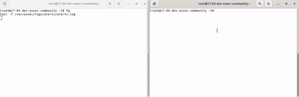
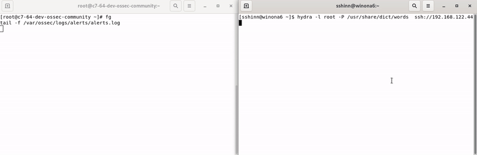

OSSEC v4.1.0 

# Information about OSSEC 

OSSEC is a full platform to monitor and control your systems. It mixes together 
all the aspects of HIDS (host-based intrusion detection), log monitoring and 
SIM/SIEM together in a simple, powerful and open source solution.

Visit our website for the latest information.  [www.ossec.net](https://www.ossec.net)

## Current Releases 

The current stable releases are available on the ossec website. 

* Releases can be downloaded from: [Downloads](https://www.ossec.net/downloads/)
* Release documentation is available at: [docs](https://www.ossec.net/docs/)

## ossec-maild and libcurl SMTP TLS ##

When built with `USE_CURL=yes`, failed SMTP sends log detailed libcurl errors in `ossec.log`: a TLS verification category line when certificate checks fail, `curl_easy_strerror` text, optional `CURLOPT_ERRORBUFFER` detail, `CURLINFO_SSL_VERIFYRESULT` (backend-specific), and `CURLINFO_OS_ERRNO` when set. See comments at the top of `src/os_maild/curlmail.c`.

## Development ##

The development version is hosted on GitHub and just a simple git clone away. 

## Screenshots ##

*File Integrity Monitoring*

*Attack Detection*

## Help / Support ##

Join us on slack, ossec.slack.com: Invites to slack@ossec.net

Join us on Discord: https://discord.gg/BXzM75Xzq7

## Credits and Thanks ##

* OSSEC comes with a modified version of zlib and a small part 
  of openssl (sha1 and blowfish libraries)
* This product includes software developed by the OpenSSL Project
  for use in the OpenSSL Toolkit (http://www.openssl.org/)
* This product includes cryptographic software written by Eric 
  Young (eay@cryptsoft.com)
* This product include software developed by the zlib project 
  (Jean-loup Gailly and Mark Adler)
* This product include software developed by the cJSON project 
  (Dave Gamble)
* [Atomicorp](https://www.atomicorp.com) hosting the annual OSSEC conference. Presentations for the 2019 conference can be found at https://www.atomicorp.com/ossec-con2019/

